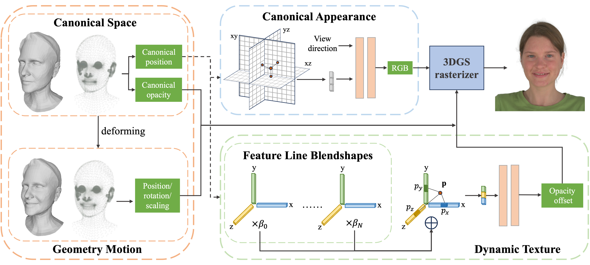

# CVPR2025 - 3D Gaussian Head Avatars with Expressive Dynamic Appearances by Compact Tensorial Representations

Yating Wang<sup>1</sup>, [Xuan Wang](https://xuanwangvc.github.io/)<sup>2</sup>, [Ran Yi](https://yiranran.github.io/)<sup>1</sup>, [Yanbo Fan](https://sites.google.com/site/yanbofan0124/)<sup>2</sup>, Jichen Hu<sup>1</sup>, Jingcheng Zhu<sup>1</sup>, [Lizhuang Ma](https://dmcv.sjtu.edu.cn/)<sup>1</sup>

Shanghai Jiaotong University<sup>1</sup>, AntGroup Research<sup>2</sup>

[arxiv](https://arxiv.org/abs/2504.14967), [project](https://wang-yating.github.io/TensorialGaussianAvatars/), [paper](https://openaccess.thecvf.com/content/CVPR2025/papers/Wang_3D_Gaussian_Head_Avatars_with_Expressive_Dynamic_Appearances_by_Compact_CVPR_2025_paper.pdf)

This is the official implementation of the paper "3D Gaussian Head Avatars with Expressive Dynamic Appearances by Compact Tensorial Representations"



## Install

1. clone this repo
   
   `git clone https://github.com/ant-research/TensorialGaussianAvatar.git  --recursive`
   
2. install requirements
   
	```
      conda create -n gsavatar python=3.10

      # install cuda11.6, pytorch1.13.0, torchvision0.14.0

      pip install -r requirements.txt
      ```
---

## Dataset and Preprocessing

### FLAME Model
Our method relies on FLAME face prior model(2023 version). Please download FLAME assets from [flame project](https://flame.is.tue.mpg.de/index.html), put flame2023.pkl(versions w/ jaw rotation) to flame_model/assets/flame/flame2023.pkl and put FLAME_masks.pkl to flame_model/assets/flame/FLAME_masks.pkl

### Test Data
We test our method on [NeRSemble](https://github.com/tobias-kirschstein/nersemble) multi-view human head videos dataset, which is preprocessed by [GaussianAvatars(CVPR2024)](https://github.com/ShenhanQian/GaussianAvatars/tree/main), please refers to [GaussianAvatars](https://github.com/ShenhanQian/GaussianAvatars/blob/main/doc/download.md) to download test data. Unlike GaussianAvatars, we use free performance sequences as the test set and other video segments as the training set.

## Usage
### Preprocess

```
# cluster expressions, please modify the dataset root path and test person id 
python expr_analyze.py

#extract jaw rotation basis
python preprocess_jaw.py
```

### Training

`./run.sh`

### Rendering

`./render.sh`


## Acknowledgments

This work was heavily inspired by [GaussianAvatars](https://github.com/ShenhanQian/GaussianAvatars/tree/main). We use [NeRSemble](https://github.com/tobias-kirschstein/nersemble) for testing. We also borrow code from the following repositories. Thanks to their impressive work!

1. Gaussian Splatting: https://github.com/graphdeco-inria/gaussian-splatting
   
2. Tri-planes: https://github.com/chiehwangs/gaussian-head

3. Axis Angle to Quanternion: https://lizhe00.github.io/projects/posevocab/
	

## Cite
If you find our paper or code useful in your research, please cite us with the following BibTeX:

```
@inproceedings{wang20253d,
  title={3D Gaussian Head Avatars with Expressive Dynamic Appearances by Compact Tensorial Representations},
  author={Wang, Yating and Wang, Xuan and Yi, Ran and Fan, Yanbo and Hu, Jichen and Zhu, Jingcheng and Ma, Lizhuang},
  booktitle={Proceedings of the Computer Vision and Pattern Recognition Conference},
  pages={21117--21126},
  year={2025}
}
```

